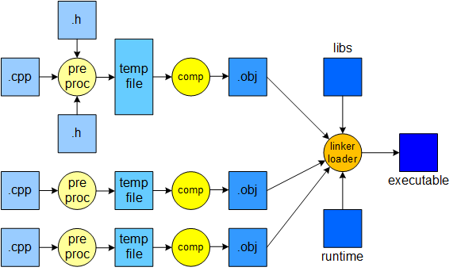

# learn_c++

1. How does c++ code gets compiled?
- The Below image shows the compilation process of c++ code.
- The C++ code is first compiled by the preprocessor, which converts the code into a different code by replacing the macros, comments, etc. with actual code.
- The output of the preprocessor is then compiled by the compiler, which converts the code into assembly code.
- The linker then links the assembly code with the library code and converts it into machine code.

2. How does namespace help in avoiding name conflicts?
- Namespaces are used to group related variables and functions, without them, all the variables and functions would exist in the global scope. This would increase the chance of naming conflicts.
- In [this](code/namespace/) example there are two header files with same class name `Speed`, by using namespace we can avoid name conflicts. and use both the classes in the same file.
